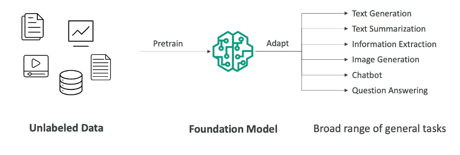

## what is genai?
- generative ai is a subset of deep learning
- used to generate new data that is similar to the data it was trained on
    - text
    - images
    - audio
    - code

## foundation model
- generate data we must rely on  foundation model
- foundation models arere trained ona  wide variety of input data
- example: gpt-4o is the foundation model behind chatgpt.
- there is a wide selection of foundation models
    - openai
    - meta
    - amazon
    - google
    - anthropic
